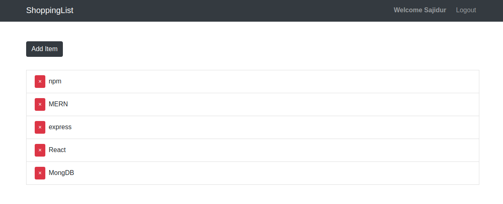

# MERN-basic
This repository cover all the basic mern-stack stuff. This repo can be a beginner frindly guide. 




> Install all package first
```
    npm install 
    npm run client-install 
```

> For run frontend and backend server same time
```
    npm run dev
```

> Run only backend api
```
    npm run server
```

> Run only react frontend 
```
    npm run client
```

